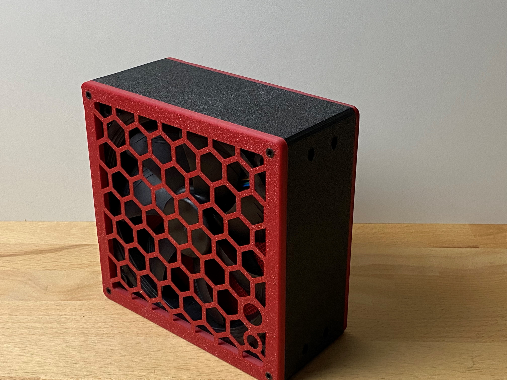
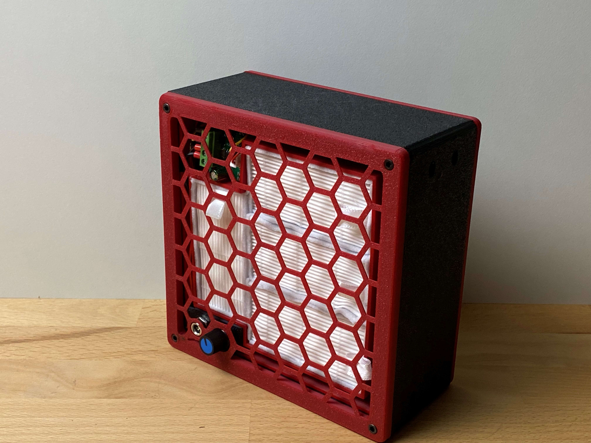
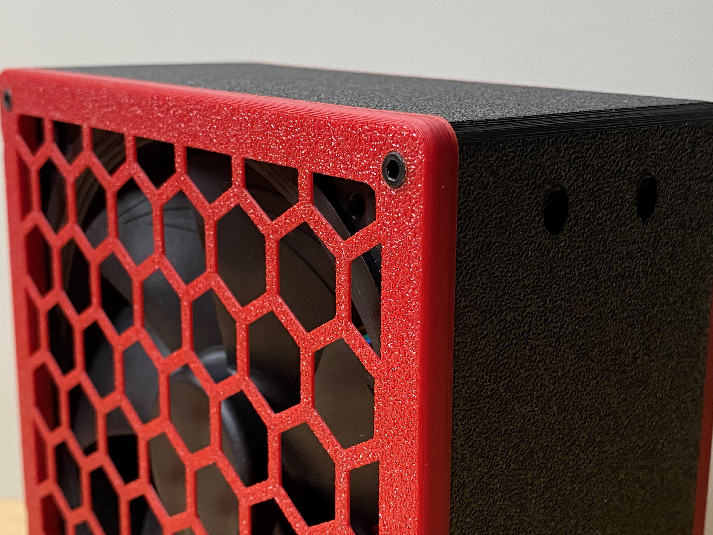
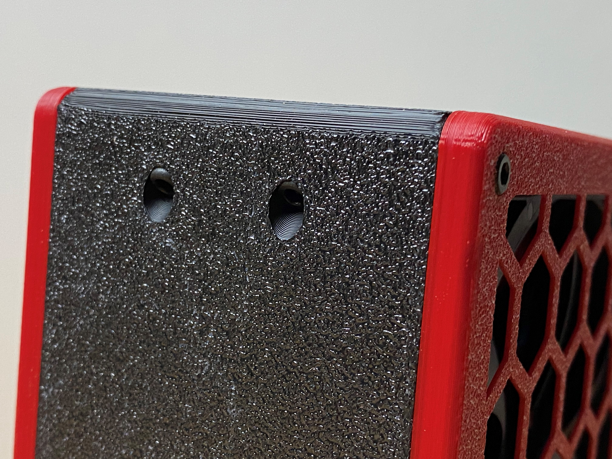

# BFACH - Boxed Filter: Activated Carbon/Charcoal + Hepa

 

 

### Why?
Since the printer produces many small particles, the goal is to filter out as many of them as possible. A few months ago my friend Deutherius had the idea to equip the original Voron exhaust fan with activated Charcoal and a Hepa filter ([VEFACH](https://github.com/VoronDesign/VoronUsers/tree/master/printer_mods/KevinAkaSam/VEFACH "VEFACH")). But I did not want an exhaust fan.
 
### How does it work?
The air first blows through activated Charcoal particles and then through the Hepa filter. The activated Charcoal removes e.g. the smell of ABS and the Hepa filter catches most of the  particles. This still doesn't remove all particles, but it is better than nothing. 

#### Flip it by 180°
Thanks to Guffy for this hint. Unfortunately, I made a mistake when I designed the filter. I thought the air would first have to pass through the activated carbon and then through the hepa, looking at other filters it is also clear why this is wrong. The Hepa collects the coarse particles, the carbon the small particles from the air. If you are very precise, the air should be filtered the other way around, as it is currently happening. I am already working on a solution. What can be done in the meantime? Solution: Simply turn the fan 180° so that the air is blown the other way around.
Since the air in the enclosure is always re-filtered anyway, this is probably negligible, but it would be wrong not to point this out. As I said, I am already working on an improvement.

### Why no exhaust fan?
Since the filter is not able to filter all particles, I do not want to filter the bad air into the clean room air, rather I want to filter the air in the enclosure over and over again. This way the room air is not permantently being contaminated and stays clean. Also problems with cold air flowing into the enclosure do not exist.

### Which version?
There are three versions for the activated Charcoal insert: One with a modeled-in mesh, one with a small support for a mosquito mesh and one without anything. The insert without mesh is for creating your own mesh by using the infill. **You need a custom mesh if you use particles smaller than 0.8 mm.**

### BOM
All parts can be printed without support. Each part has to be printed once. For the carbon container, two parts must be joined together. See under "Which Version" which files you need.
* 4 Hepa Filters (https://www.aliexpress.com/item/1005001615722382.html)
* ~500g activated coal particles (~1mm)
* 16x M3x8mm or 10mm screws
* 16x Brass heat insert (I have used M3x5.7mm ones; the holes have a size of 4mm)
* 1x Noctua NF-A14 iPPC-3000 PWM (3000 RPM)
* 1x DC PWM Controller (I have used this one (German Amazon) https://www.amazon.de/gp/product/B075FRH5DP/ref=ppx_yo_dt_b_asin_title_o06_s00?ie=UTF8&psc=1)
* 1x DC Plug (https://de.aliexpress.com/item/4000648876487.html?)
* 1x DC PSU (min. 1A, I used 3A) (https://de.aliexpress.com/item/4001272105871.html?)

Thanks to Jon for the name.
Contact: Discord (kevinakasam#2097)
