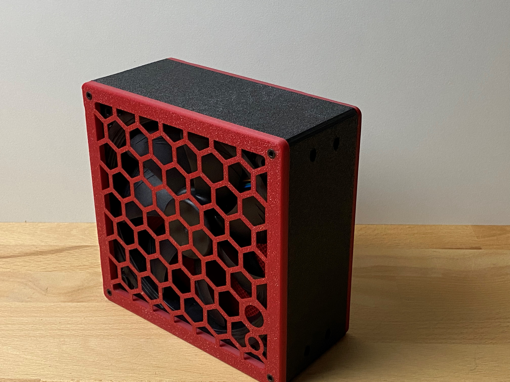
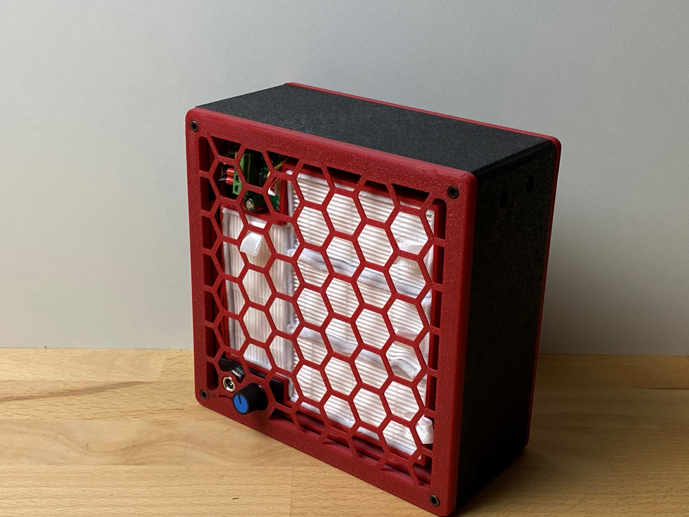
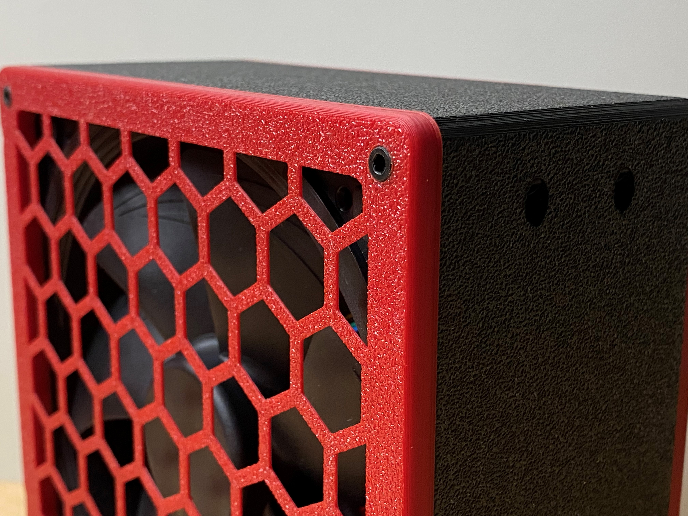
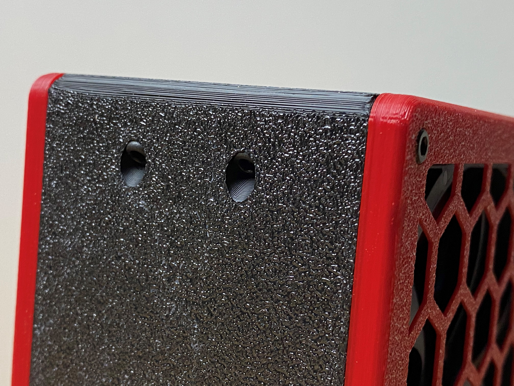

# BFACH - Boxed Filter: Activated Carbon/Charcoal + Hepa

 

 

### Why?
Since the printer produces many small particles, the goal is to filter out as many of them as possible. A few months ago my friend Deutherius had the idea to equip the original Voron exhaust fan with activated Charcoal and a Hepa filter (LINK TO VEFACH). The filter materials can be removed and replaced very easily via the original cover.
 
### How does it work?
The air first blows through activated Charcoal particles and then through the Hepa filter. The activated Charcoal removes e.g. the smell of ABS and the Hepa filter catches most of the small particles. This still doesn't remove all particles, but it is better than nothing. 

### Why no exhaust fan?
Since the filter is not able to filter all particles, I do not want to filter the bad air into the clean room air, rather I want to filter the air in the enclosure over and over again. This way the room air is not permantently being contaminated and stays clean. Also problems with cold air flowing into the enclosure do not exist.

### Which version?
There are three versions for the activated Charcoal insert: One with a modeled-in mesh, one with a small support for a mosquito mesh and one without anything. The insert without mesh is for creating your own mesh by using the infill. **You need a custom mesh if you use particles smaller than 0.8 mm.**

## Stay tuned for more information
